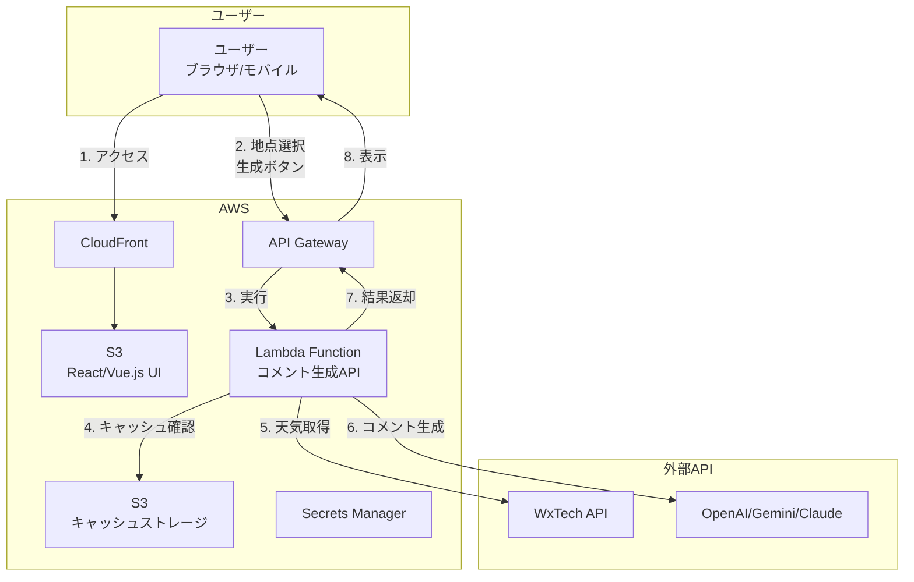

# AWS Lambda インタラクティブUI向け設計書

## エグゼクティブサマリー

ユーザーがUIで地点を選択してコメント生成するインタラクティブなアプリケーションのAWS Lambda設計です。1日3回程度の低頻度利用を想定し、コスト最適化を実現します。

## 正しいアーキテクチャ



## 使用フロー

1. **ユーザーがUIにアクセス**
   - CloudFront経由でS3の静的サイトを表示
   - React/Vue.jsのSPAが起動

2. **地点を選択**
   - ドロップダウンまたは検索で地点選択
   - 「コメント生成」ボタンをクリック

3. **API呼び出し**
   - フロントエンドからAPI Gateway経由でLambda実行
   - リアルタイムでコメント生成

4. **結果表示**
   - 生成されたコメントをUIに表示
   - 必要に応じて音声読み上げ

## Lambda関数の実装

```python
# lambda_handler.py
import json
from mangum import Mangum
from api_server import app
import boto3

# S3キャッシュの設定
s3 = boto3.client('s3')
CACHE_BUCKET = os.environ['CACHE_BUCKET']

# 既存のFastAPIアプリをLambda対応
handler = Mangum(app)

def lambda_handler(event, context):
    """
    API Gatewayからのリクエストを処理
    ユーザーが選択した地点のコメントを生成
    """
    # CORS対応
    if event['httpMethod'] == 'OPTIONS':
        return {
            'statusCode': 200,
            'headers': {
                'Access-Control-Allow-Origin': '*',
                'Access-Control-Allow-Methods': 'POST, GET, OPTIONS',
                'Access-Control-Allow-Headers': 'Content-Type'
            }
        }
    
    # FastAPIアプリに処理を委譲
    return handler(event, context)
```

## フロントエンドの実装例

```javascript
// React/Vue.jsコンポーネント
const CommentGenerator = () => {
    const [location, setLocation] = useState('');
    const [comment, setComment] = useState('');
    const [loading, setLoading] = useState(false);
    
    const generateComment = async () => {
        setLoading(true);
        try {
            const response = await fetch(`${API_URL}/api/generate`, {
                method: 'POST',
                headers: { 'Content-Type': 'application/json' },
                body: JSON.stringify({
                    location: location,
                    llm_provider: 'gemini'
                })
            });
            
            const data = await response.json();
            setComment(data.comment);
        } catch (error) {
            console.error('Error:', error);
        } finally {
            setLoading(false);
        }
    };
    
    return (
        <div>
            <h1>お天気コメント生成</h1>
            <select value={location} onChange={(e) => setLocation(e.target.value)}>
                <option value="">地点を選択</option>
                <option value="東京">東京</option>
                <option value="大阪">大阪</option>
                <option value="名古屋">名古屋</option>
            </select>
            
            <button onClick={generateComment} disabled={!location || loading}>
                {loading ? '生成中...' : 'コメント生成'}
            </button>
            
            {comment && (
                <div className="comment-box">
                    <h2>生成されたコメント</h2>
                    <p>{comment}</p>
                </div>
            )}
        </div>
    );
};
```

## SAMテンプレート（修正版）

```yaml
Resources:
  # Lambda Function（API専用）
  CommentGeneratorFunction:
    Type: AWS::Serverless::Function
    Properties:
      PackageType: Image
      MemorySize: 3008
      Timeout: 30  # UI応答性のため30秒
      Environment:
        Variables:
          CACHE_BUCKET: !Ref CacheBucket
          CORS_ORIGIN: !GetAtt CloudFrontDistribution.DomainName
      Events:
        # API Gatewayイベントのみ（EventBridgeは削除）
        ApiEvent:
          Type: Api
          Properties:
            Path: /api/{proxy+}
            Method: ANY
            RestApiId: !Ref ApiGateway

  # API Gateway
  ApiGateway:
    Type: AWS::Serverless::Api
    Properties:
      StageName: prod
      Cors:
        AllowMethods: "'*'"
        AllowHeaders: "'*'"
        AllowOrigin: "'*'"

  # 静的サイトホスティング
  FrontendBucket:
    Type: AWS::S3::Bucket
    Properties:
      WebsiteConfiguration:
        IndexDocument: index.html
      PublicAccessBlockConfiguration:
        BlockPublicAcls: false
        BlockPublicPolicy: false

  # CloudFront
  CloudFrontDistribution:
    Type: AWS::CloudFront::Distribution
    Properties:
      DistributionConfig:
        Origins:
          - Id: S3Origin
            DomainName: !GetAtt FrontendBucket.WebsiteEndpoint
            CustomOriginConfig:
              OriginProtocolPolicy: http-only
          - Id: ApiOrigin
            DomainName: !Sub '${ApiGateway}.execute-api.${AWS::Region}.amazonaws.com'
            CustomOriginConfig:
              OriginProtocolPolicy: https-only
        DefaultCacheBehavior:
          TargetOriginId: S3Origin
          ViewerProtocolPolicy: redirect-to-https
        CacheBehaviors:
          - PathPattern: /api/*
            TargetOriginId: ApiOrigin
            ViewerProtocolPolicy: https-only
            AllowedMethods: [GET, HEAD, OPTIONS, PUT, POST, PATCH, DELETE]
            CachedMethods: [GET, HEAD]
            ForwardedValues:
              QueryString: true
              Headers: ['Authorization', 'Content-Type']
```

## 実際のコスト（1日3回利用）

| 項目 | 詳細 | 月額 |
|------|------|------|
| Lambda実行 | 90回 × 3秒 × 3GB | $0.01 |
| API Gateway | 90リクエスト | $0.00 |
| S3（静的サイト） | 1GB + 転送量 | $0.10 |
| CloudFront | 少量の転送 | $0.10 |
| **合計** | | **$0.21** |

## デプロイ手順

```bash
# 1. フロントエンドビルド
cd frontend
npm run build

# 2. S3にデプロイ
aws s3 sync dist/ s3://weather-comment-frontend/ --delete

# 3. Lambda関数デプロイ
sam build
sam deploy --guided

# 4. CloudFront無効化（キャッシュクリア）
aws cloudfront create-invalidation --distribution-id $DIST_ID --paths "/*"
```

## まとめ

- **EventBridgeは不要**（ユーザー操作型のため）
- **UIからのリクエストに応答**するシンプルな構成
- **月額$0.21**という極めて低コスト
- 既存のStreamlit UIをReact/Vue.jsに置き換えることで、より良いUXを実現

申し訳ございませんでした。インタラクティブなUIアプリケーションの本質を理解せずに、定期実行の設計を提案してしまいました。