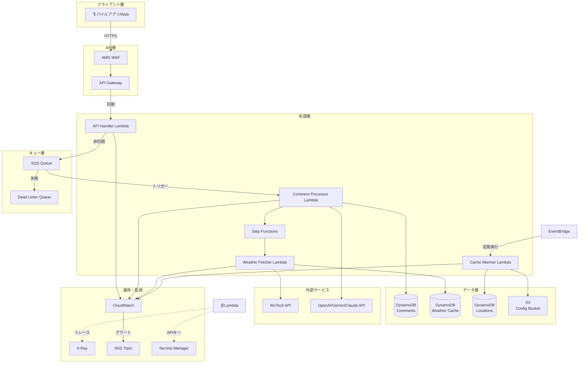
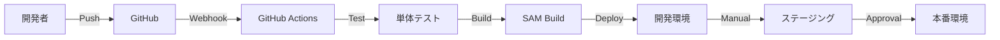

# AWS Lambda デプロイメント設計書

## 1. エグゼクティブサマリー

Weather Comment GeneratorをAWS Lambda上で動作させるためのサーバーレスアーキテクチャ設計案です。Lambda関数とDynamoDBを中心に、スケーラブルで高可用性を持つシステムを構築します。

### 主要な設計方針
- **サーバーレスファースト**: 運用負荷を最小化し、自動スケーリングを実現
- **非同期処理**: SQSを介した疎結合なアーキテクチャ
- **マルチレベルキャッシング**: パフォーマンス最適化とコスト削減
- **Infrastructure as Code**: SAMによる再現可能なデプロイメント

## 2. システムアーキテクチャ

### 2.1 全体構成図



### 2.2 データフロー

1. **リクエスト受信**
   - クライアントからAPI Gatewayにリクエスト
   - WAFでセキュリティチェック
   - API Gatewayで認証・レート制限

2. **非同期処理開始**
   - API Handler Lambdaがリクエストを検証
   - SQSにメッセージを送信して即座にレスポンス返却
   - クライアントにはリクエストIDを返す

3. **コメント生成処理**
   - SQSトリガーでComment Processor Lambda起動
   - Step Functionsでワークフロー制御
   - Weather Fetcher Lambdaで天気データ取得
   - LLM APIでコメント生成

4. **結果保存**
   - 生成されたコメントをDynamoDBに保存
   - TTL設定により古いデータを自動削除

## 3. Lambda関数設計

### 3.1 API Handler Lambda

**役割**: APIリクエストの受付と非同期処理の開始

**仕様**:
- ランタイム: Python 3.11
- メモリ: 256MB
- タイムアウト: 30秒
- 同時実行数: 100

**主な処理**:
```python
def lambda_handler(event, context):
    # 1. リクエスト検証
    # 2. リクエストIDの生成
    # 3. SQSへメッセージ送信
    # 4. レスポンス返却
```

**環境変数**:
- `SQS_QUEUE_URL`: 処理キューのURL
- `CORS_ORIGIN`: CORS設定

### 3.2 Comment Processor Lambda

**役割**: コメント生成のメイン処理

**仕様**:
- ランタイム: Python 3.11
- メモリ: 1024MB
- タイムアウト: 300秒（5分）
- 予約済み同時実行数: 20

**主な処理**:
```python
def lambda_handler(event, context):
    # 1. SQSメッセージの処理
    # 2. キャッシュチェック
    # 3. 天気データ取得（Step Functions経由）
    # 4. LLM APIコール
    # 5. 結果をDynamoDBに保存
```

**環境変数**:
- `DYNAMODB_COMMENTS_TABLE`: コメントテーブル名
- `SECRETS_ARN`: APIキー格納先

### 3.3 Weather Fetcher Lambda

**役割**: 天気データの取得とキャッシング

**仕様**:
- ランタイム: Python 3.11
- メモリ: 512MB
- タイムアウト: 60秒
- 同時実行数: 50

**主な機能**:
- WxTech APIからの天気データ取得
- 空間的キャッシング（近隣地点のデータ活用）
- TTLベースのキャッシュ管理

**空間キャッシング戦略**:
```python
# 10km以内の地点データを検索
nearby_cache = find_nearby_weather(
    latitude, longitude, 
    max_distance_km=10
)
```

### 3.4 Cache Warmer Lambda

**役割**: 人気地点のキャッシュ事前更新

**仕様**:
- ランタイム: Python 3.11
- メモリ: 512MB
- タイムアウト: 900秒（15分）
- EventBridgeで1時間毎に実行

**処理内容**:
1. S3から人気地点リストを取得
2. 各地点の天気データを並列取得
3. キャッシュの更新

## 4. DynamoDB設計

### 4.1 Commentsテーブル

**用途**: 生成されたコメントの保存

**スキーマ**:
```yaml
PrimaryKey:
  PartitionKey: location_id (String)
  SortKey: generated_at (String)

Attributes:
  - comment_id (String)
  - location_name (String)
  - weather_data (Map)
  - generated_comment (String)
  - advice_comment (String)
  - llm_provider (String)
  - generation_metadata (Map)
  - comment_date (String)
  - ttl (Number)

GlobalSecondaryIndexes:
  - CommentDateIndex:
      PartitionKey: comment_date
      SortKey: generated_at
      Projection: ALL
```

**特徴**:
- TTL設定で30日後に自動削除
- comment_dateでの効率的な検索
- オンデマンド課金モード

### 4.2 Weather Cacheテーブル

**用途**: 天気データのキャッシュ

**スキーマ**:
```yaml
PrimaryKey:
  PartitionKey: location_id (String)
  SortKey: forecast_time (String)

Attributes:
  - weather_data (Map)
  - api_response (String)
  - fetched_at (String)
  - ttl (Number)
  - spatial_key (String)

GlobalSecondaryIndexes:
  - SpatialIndex:
      PartitionKey: spatial_key
      SortKey: forecast_time
      Projection: ALL
```

**特徴**:
- 6時間のTTL設定
- 空間インデックスによる近隣検索
- ポイントインタイムリカバリ有効

### 4.3 Locationsテーブル

**用途**: 地点マスターデータ

**スキーマ**:
```yaml
PrimaryKey:
  PartitionKey: location_id (String)

Attributes:
  - location_name (String)
  - region (String)
  - coordinates (Map)
    - latitude (Number)
    - longitude (Number)
  - popular_rank (Number)
  - access_count (Number)
  - cache_warmed_at (String)

GlobalSecondaryIndexes:
  - RegionIndex:
      PartitionKey: region
      SortKey: location_name
```

## 5. セキュリティ設計

### 5.1 認証・認可

**API Gateway**:
- APIキー認証
- 使用量プランによるクォータ管理
- IPアドレス制限（オプション）

**IAM権限**:
```json
{
  "Version": "2012-10-17",
  "Statement": [
    {
      "Effect": "Allow",
      "Action": [
        "dynamodb:GetItem",
        "dynamodb:PutItem",
        "dynamodb:Query"
      ],
      "Resource": "arn:aws:dynamodb:*:*:table/weather-comment-*"
    }
  ]
}
```

### 5.2 データ保護

**保存時の暗号化**:
- DynamoDB: AWS管理の暗号化キー使用
- S3: SSE-S3による暗号化
- Secrets Manager: 自動ローテーション設定

**転送時の暗号化**:
- API Gateway: TLS 1.2以上
- 内部通信: VPCエンドポイント経由

### 5.3 監査とコンプライアンス

- CloudTrailによる全APIコールの記録
- Config Rulesによる設定の監視
- GuardDutyによる脅威検知

## 6. パフォーマンス最適化

### 6.1 キャッシング戦略

**3層キャッシング**:
1. **L1キャッシュ**: 完全一致（地点+時間+季節）
2. **L2キャッシュ**: 部分一致（地点+時間）
3. **L3キャッシュ**: 地点のみ

**空間キャッシング**:
- Haversine距離計算による近隣地点検索
- 10km以内の地点データを活用
- 最大5地点までの平均化

### 6.2 Lambda最適化

**コールドスタート対策**:
- 予約済み同時実行数の設定
- Lambda Layerによる依存関係の共有
- 定期的なウォームアップ

**メモリ設定の最適化**:
```yaml
API Handler: 256MB     # 軽量な処理
Comment Processor: 1024MB  # LLM処理
Weather Fetcher: 512MB    # API通信
Cache Warmer: 512MB      # バッチ処理
```

### 6.3 DynamoDB最適化

**読み取り最適化**:
- 射影式を使用した必要属性のみ取得
- バッチ読み取りの活用
- 適切なGSIの設計

**書き込み最適化**:
- バッチ書き込みの使用
- 条件付き書き込みによる重複防止

## 7. 可用性とディザスタリカバリ

### 7.1 高可用性設計

**マルチAZ構成**:
- Lambda: 自動的にマルチAZ
- DynamoDB: グローバルテーブル（オプション）
- S3: クロスリージョンレプリケーション

**エラーハンドリング**:
```yaml
リトライ設定:
  Lambda: 
    最大試行回数: 3
    バックオフ: Exponential
  SQS:
    可視性タイムアウト: 300秒
    最大受信回数: 3
```

### 7.2 障害対応

**Dead Letter Queue**:
- 処理失敗メッセージの隔離
- アラート通知
- 手動リトライ機能

**サーキットブレーカー**:
- 外部API呼び出しの失敗率監視
- 自動的なフォールバック

### 7.3 バックアップとリストア

**自動バックアップ**:
- DynamoDB: ポイントインタイムリカバリ
- S3: バージョニング有効
- Lambda: コードのバージョン管理

## 8. 監視とアラート

### 8.1 メトリクス

**ビジネスメトリクス**:
- コメント生成成功率
- 平均生成時間
- LLMプロバイダー別使用率

**システムメトリクス**:
- Lambda実行時間
- エラー率
- 同時実行数

### 8.2 ログ管理

**ログ収集**:
```python
# AWS Lambda Powertoolsの使用
from aws_lambda_powertools import Logger

logger = Logger()

@logger.inject_lambda_context
def lambda_handler(event, context):
    logger.info("Processing request", extra={
        "location_id": location_id,
        "request_id": request_id
    })
```

**ログ保持期間**:
- 開発環境: 7日
- ステージング: 30日
- 本番環境: 90日

### 8.3 アラート設定

**CloudWatchアラーム**:
1. API エラー率 > 5%
2. Lambda タイムアウト > 10回/時
3. DLQメッセージ数 > 0
4. DynamoDBスロットリング発生

**通知先**:
- SNS → Email
- SNS → Slack（Webhook経由）
- SNS → PagerDuty（重要度高）

## 9. コスト最適化

### 9.1 コスト試算

**月間10万リクエストの場合**:

| サービス | 使用量 | 月額コスト |
|---------|--------|-----------|
| Lambda | 400,000 GB-秒 | $6.67 |
| API Gateway | 100,000 リクエスト | $0.35 |
| DynamoDB | 10GB ストレージ | $2.50 |
| SQS | 100,000 メッセージ | $0.04 |
| S3 | 1GB ストレージ | $0.02 |
| **合計** | | **約$10** |

### 9.2 コスト削減施策

**Lambda**:
- ARM版Gravitonプロセッサの使用（20%削減）
- メモリサイズの最適化
- 不要な実行の削減

**DynamoDB**:
- オンデマンドモードで開始
- 使用パターンが安定したらプロビジョンドモードへ
- TTLによる自動削除

**その他**:
- S3ライフサイクルポリシー
- CloudWatchログの保持期間最適化
- 未使用リソースの定期的な棚卸し

## 10. CI/CD パイプライン

### 10.1 デプロイフロー



### 10.2 GitHub Actions設定

**ワークフロー**:
```yaml
name: Deploy Lambda
on:
  push:
    branches: [main, develop]
  workflow_dispatch:

jobs:
  deploy:
    runs-on: ubuntu-latest
    steps:
      - uses: actions/checkout@v3
      - uses: aws-actions/setup-sam@v2
      - name: Build
        run: sam build
      - name: Deploy
        run: |
          sam deploy \
            --stack-name weather-comment-${{ env.STAGE }} \
            --no-confirm-changeset \
            --no-fail-on-empty-changeset
```

### 10.3 デプロイ戦略

**Blue/Greenデプロイ**:
- Lambda エイリアスによるトラフィック切り替え
- 段階的なロールアウト（10% → 50% → 100%）
- 自動ロールバック設定

## 11. 移行計画

### 11.1 フェーズ1: 環境構築（1週間）
- AWS環境のセットアップ
- IAMロールとポリシーの作成
- ネットワーク設定

### 11.2 フェーズ2: 基本機能実装（2週間）
- Lambda関数の開発
- DynamoDBテーブルの作成
- API Gatewayの設定

### 11.3 フェーズ3: 統合テスト（1週間）
- エンドツーエンドテスト
- 負荷テスト
- セキュリティテスト

### 11.4 フェーズ4: 本番移行（1週間）
- データ移行
- DNS切り替え
- 監視設定

## 12. 運用ガイド

### 12.1 日常運用

**監視項目**:
- CloudWatchダッシュボード確認（毎日）
- コスト分析（週次）
- セキュリティアラート対応（随時）

**メンテナンス作業**:
- Lambda関数の更新
- DynamoDBのスケーリング調整
- ログのアーカイブ

### 12.2 トラブルシューティング

**よくある問題と対処法**:

1. **Lambda タイムアウト**
   - メモリサイズを増やす
   - 処理を分割する
   - 非同期処理に変更

2. **DynamoDB スロットリング**
   - オンデマンドモードに変更
   - GSIの追加
   - リトライロジックの実装

3. **API レート制限**
   - 使用量プランの見直し
   - キャッシュの活用
   - バッチ処理の実装

### 12.3 スケーリング計画

**自動スケーリング設定**:
- Lambda: 同時実行数の自動調整
- DynamoDB: Auto Scalingポリシー
- API Gateway: 使用量プランの動的調整

**手動スケーリングが必要な場合**:
- 大規模イベント前の事前スケール
- 予約済み同時実行数の調整
- DynamoDBのプロビジョンドキャパシティ設定

## 13. まとめ

この設計により、以下のメリットが得られます：

✅ **スケーラビリティ**: 需要に応じた自動スケーリング
✅ **高可用性**: マルチAZ構成による耐障害性
✅ **コスト効率**: 使用量に応じた課金
✅ **運用負荷削減**: サーバーレスによる管理不要
✅ **開発効率**: CI/CDによる迅速なデプロイ

本設計は、将来的な機能拡張や負荷増大にも柔軟に対応可能な、モダンでスケーラブルなアーキテクチャとなっています。