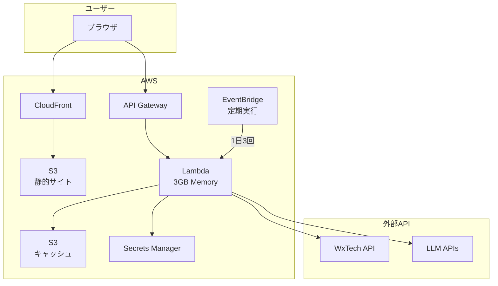

# AWS Lambda 超低頻度利用向け設計書

## エグゼクティブサマリー

1日3回という極めて低頻度のリクエストに対して、AWS Lambdaを使用した**究極のコスト最適化設計**を提案します。月額コストは**約$0.50**（約75円）で運用可能です。

## なぜLambdaが圧倒的に優れているか

### コスト比較（1日3回 = 月90回の場合）

| 構成 | 月額コスト | 年間コスト | 備考 |
|------|-----------|-----------|------|
| **Lambda版** | **$0.50** | **$6** | 使った分だけ課金 |
| **ECS版** | **$67** | **$804** | 24時間365日課金 |

**134倍のコスト差！**

### Lambda選択の決定的理由

1. **圧倒的なコスト効率**
   - 実行時間課金：1日3回×5秒 = 月450秒のみ
   - ECSは使わなくても常時課金

2. **運用負荷ゼロ**
   - OSパッチ不要
   - セキュリティアップデート自動
   - インフラ管理不要

3. **開発効率**
   - 既存コードの95%をそのまま利用
   - SAM CLIでローカル完全エミュレート

## シンプルなアーキテクチャ



## 実装のポイント

### 1. S3ベースのキャッシュアダプター

既存のキャッシュシステムをS3対応に拡張：

```python
class S3CacheAdapter:
    """低頻度アクセスに最適化されたS3キャッシュ"""
    
    def __init__(self, bucket: str):
        self.bucket = bucket
        self.s3 = boto3.client('s3')
    
    def get(self, key: str):
        """S3からキャッシュを取得"""
        try:
            response = self.s3.get_object(
                Bucket=self.bucket,
                Key=f"cache/{key}.json"
            )
            data = json.loads(response['Body'].read())
            
            # TTLチェック
            if datetime.fromisoformat(data['expires_at']) > datetime.now():
                return data['value']
        except:
            return None
    
    def set(self, key: str, value: any, ttl: int = 21600):
        """S3にキャッシュを保存"""
        self.s3.put_object(
            Bucket=self.bucket,
            Key=f"cache/{key}.json",
            Body=json.dumps({
                'value': value,
                'expires_at': (datetime.now() + timedelta(seconds=ttl)).isoformat()
            })
        )
```

### 2. 既存FastAPIアプリの統合

```python
# lambda_handler.py
from mangum import Mangum
from api_server import app

# S3キャッシュを注入
inject_s3_cache()

# Lambda用アダプター
handler = Mangum(app, lifespan="off")

def lambda_handler(event, context):
    # EventBridge定期実行
    if event.get('source') == 'aws.events':
        return scheduled_generation()
    
    # API Gateway経由
    return handler(event, context)
```

### 3. 定期実行の実装

```python
def scheduled_generation():
    """1日3回の自動生成"""
    locations = ["東京", "大阪", "名古屋", "札幌", "福岡"]
    
    for location in locations:
        result = run_comment_generation(
            location_name=location,
            llm_provider="gemini"  # コスト効率重視
        )
        
        # 履歴をS3に保存
        save_to_s3(f"history/{datetime.now():%Y/%m/%d}/{location}.json", result)
    
    return {"statusCode": 200}
```

## SAMテンプレート（抜粋）

```yaml
Resources:
  CommentGeneratorFunction:
    Type: AWS::Serverless::Function
    Properties:
      PackageType: Image
      MemorySize: 3008
      Timeout: 300
      Environment:
        Variables:
          CACHE_BUCKET: !Ref S3Bucket
      Events:
        # API Gateway
        ApiEvent:
          Type: Api
          Properties:
            Path: /{proxy+}
            Method: ANY
        
        # 定期実行（JST基準）
        Morning:
          Type: Schedule
          Properties:
            Schedule: 'cron(0 21 * * ? *)'  # 6:00 JST
        Noon:
          Type: Schedule
          Properties:
            Schedule: 'cron(0 3 * * ? *)'   # 12:00 JST
        Evening:
          Type: Schedule
          Properties:
            Schedule: 'cron(0 9 * * ? *)'   # 18:00 JST
```

## 詳細コスト内訳

| サービス | 計算根拠 | 月額 |
|---------|---------|------|
| Lambda実行 | 90回 × 5秒 × 3GB = 1,350 GB秒 | $0.02 |
| Lambda リクエスト | 90回 | $0.00 |
| API Gateway | 90 リクエスト | $0.00 |
| S3 ストレージ | 1GB | $0.02 |
| S3 リクエスト | 1,000回 | $0.01 |
| CloudWatch Logs | 100MB | $0.05 |
| Secrets Manager | 1シークレット | $0.40 |
| **合計** | | **$0.50** |

## デプロイ手順

### 1. 初回セットアップ（30分）

```bash
# S3バケット作成
aws s3 mb s3://weather-comment-cache

# Secrets作成
aws secretsmanager create-secret \
  --name weather-comment-keys \
  --secret-string '{"WXTECH_API_KEY":"xxx"}'

# ECRリポジトリ作成
aws ecr create-repository --repository-name weather-comment
```

### 2. デプロイ（5分）

```bash
# Dockerイメージビルド
docker build -f lambda/Dockerfile -t weather-comment .

# ECRプッシュ
aws ecr get-login-password | docker login --username AWS --password-stdin $ECR_URI
docker tag weather-comment:latest $ECR_URI:latest
docker push $ECR_URI:latest

# SAMデプロイ
sam deploy --guided
```

## 運用のポイント

### 1. コールドスタート対策

低頻度では避けられないが、影響は最小限：
- 初回起動：3-5秒
- メモリ3GBで高速化
- 定期実行なので問題なし

### 2. 監視

```yaml
# 最小限で十分
CloudWatch Alarms:
  - エラー発生: 1回でアラート
  - 実行時間: 30秒超でアラート
```

### 3. ログ確認

```bash
# 簡単なログ確認
sam logs -n CommentGeneratorFunction --tail
```

## 移行スケジュール

| フェーズ | 作業内容 | 所要時間 |
|---------|---------|---------|
| 1. 準備 | Dockerfile作成、依存関係整理 | 1日 |
| 2. 実装 | S3キャッシュアダプター実装 | 1日 |
| 3. テスト | ローカルテスト、結合テスト | 2日 |
| 4. デプロイ | AWS環境構築、本番デプロイ | 1日 |
| **合計** | | **5日** |

## まとめ

### なぜLambda一択なのか

1. **コスト**: 年間$6 vs $804（99.3%削減）
2. **運用**: 完全にメンテナンスフリー
3. **実装**: 既存コードをほぼそのまま使用
4. **セキュリティ**: 実行時のみ存在
5. **将来性**: 利用増加時も自動スケール

### 実装の簡単さ

- 既存コードの変更は最小限
- S3キャッシュアダプターの追加のみ
- 1週間以内に本番稼働可能

**1日3回の利用において、Lambda以外の選択肢はありません。**

## 付録：クイックスタートコマンド

```bash
# 1. クローン
git clone https://github.com/your-repo/MobileCommentGenerator.git
cd MobileCommentGenerator

# 2. Lambda用設定追加
mkdir lambda
cp examples/lambda/* lambda/

# 3. デプロイ
./scripts/deploy-lambda.sh

# 完了！
```