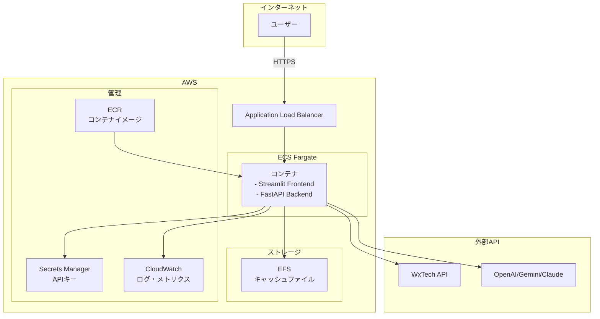

# AWS デプロイメント設計書（改訂版）

## 1. エグゼクティブサマリー

Weather Comment GeneratorをAWSにデプロイするための**シンプルで実用的な**設計案です。既存のアプリケーション機能を最大限活用し、不要な複雑性を排除した設計となっています。

### 設計方針
- **シンプルさ優先**: 過度な分散化を避け、管理しやすい構成
- **既存機能の活用**: アプリケーション内蔵の並列処理・キャッシング機能を活用
- **コスト効率**: 実用的な価格帯での運用（月額$50-100程度）
- **運用容易性**: 標準的なパターンで構築・運用が容易

## 2. アーキテクチャ概要

### 2.1 シンプルな構成



### 2.2 なぜこの設計か？

1. **単一コンテナ構成**
   - フロントエンド（Streamlit）とバックエンド（FastAPI）を1つのコンテナで実行
   - 管理の複雑性を大幅に削減
   - コールドスタート問題を回避

2. **ECS Fargate選択理由**
   - サーバーレスでありながら常時起動可能
   - 自動スケーリング対応
   - Lambda関数の制限（15分タイムアウト等）を回避

3. **既存機能をそのまま活用**
   - 並列処理（4ワーカー）
   - 3層キャッシング
   - 空間キャッシュクラスタリング
   - メモリ監視

## 3. 詳細設計

### 3.1 ECS タスク定義

```json
{
  "family": "weather-comment-generator",
  "networkMode": "awsvpc",
  "requiresCompatibilities": ["FARGATE"],
  "cpu": "1024",
  "memory": "2048",
  "containerDefinitions": [
    {
      "name": "app",
      "image": "${ECR_URI}:latest",
      "portMappings": [
        {
          "containerPort": 8501,
          "protocol": "tcp"
        },
        {
          "containerPort": 8000,
          "protocol": "tcp"
        }
      ],
      "environment": [
        {
          "name": "ENV",
          "value": "production"
        },
        {
          "name": "MAX_PARALLEL_WORKERS",
          "value": "4"
        }
      ],
      "secrets": [
        {
          "name": "WXTECH_API_KEY",
          "valueFrom": "arn:aws:secretsmanager:ap-northeast-1:xxx:secret:api-keys:WXTECH_API_KEY::"
        },
        {
          "name": "OPENAI_API_KEY",
          "valueFrom": "arn:aws:secretsmanager:ap-northeast-1:xxx:secret:api-keys:OPENAI_API_KEY::"
        }
      ],
      "mountPoints": [
        {
          "sourceVolume": "cache-storage",
          "containerPath": "/app/cache"
        }
      ],
      "logConfiguration": {
        "logDriver": "awslogs",
        "options": {
          "awslogs-group": "/ecs/weather-comment-generator",
          "awslogs-region": "ap-northeast-1",
          "awslogs-stream-prefix": "ecs"
        }
      }
    }
  ],
  "volumes": [
    {
      "name": "cache-storage",
      "efsVolumeConfiguration": {
        "fileSystemId": "${EFS_ID}",
        "transitEncryption": "ENABLED"
      }
    }
  ]
}
```

### 3.2 Dockerfile

```dockerfile
FROM python:3.11-slim

WORKDIR /app

# システム依存関係
RUN apt-get update && apt-get install -y \
    gcc \
    && rm -rf /var/lib/apt/lists/*

# Python依存関係
COPY requirements.txt .
RUN pip install --no-cache-dir -r requirements.txt

# アプリケーションコード
COPY . .

# ポート公開
EXPOSE 8501 8000

# 起動スクリプト
CMD ["sh", "-c", "streamlit run app.py --server.port=8501 --server.address=0.0.0.0 & python api_server.py"]
```

### 3.3 Application Load Balancer設定

```yaml
Listeners:
  - Port: 443
    Protocol: HTTPS
    Certificates:
      - CertificateArn: ${ACM_CERTIFICATE_ARN}
    DefaultActions:
      - Type: forward
        TargetGroupArn: ${TARGET_GROUP_ARN}

TargetGroups:
  - Name: weather-comment-tg
    Port: 8501
    Protocol: HTTP
    HealthCheckPath: /
    HealthCheckIntervalSeconds: 30
    Targets:
      - Type: ip
```

## 4. データ永続化戦略

### 4.1 EFSによるキャッシュ管理

```yaml
FileSystem:
  PerformanceMode: generalPurpose
  ThroughputMode: bursting
  LifecyclePolicy:
    TransitionToIA: AFTER_30_DAYS
  FileSystemTags:
    - Key: Name
      Value: weather-comment-cache
```

**キャッシュファイル構造**:
```
/app/cache/
├── forecast/          # 天気予報キャッシュ
├── comments/          # 生成済みコメントキャッシュ
└── spatial/           # 空間キャッシュデータ
```

### 4.2 キャッシュ戦略

既存の実装をそのまま活用：

1. **メモリキャッシュ** (L1)
   - LRUキャッシュ（最大500エントリ）
   - TTL: 300秒

2. **ファイルキャッシュ** (L2)
   - EFSに保存
   - TTL: 6時間

3. **空間キャッシュ**
   - 10km以内の地点データを活用
   - Haversine距離計算

## 5. スケーリング戦略

### 5.1 オートスケーリング設定

```yaml
Service:
  DesiredCount: 1
  MinimumHealthyPercent: 100
  MaximumPercent: 200

AutoScaling:
  MinCapacity: 1
  MaxCapacity: 4
  TargetTrackingScalingPolicies:
    - MetricType: ECSServiceAverageCPUUtilization
      TargetValue: 70
    - MetricType: ECSServiceAverageMemoryUtilization  
      TargetValue: 80
```

### 5.2 並列処理の活用

アプリケーション内蔵の並列処理機能：
- 最大4ワーカーで複数地点を同時処理
- タスクあたり2GB RAMで十分な並列実行が可能

## 6. セキュリティ

### 6.1 ネットワークセキュリティ

```yaml
SecurityGroups:
  ALB:
    - Port: 443
      Source: 0.0.0.0/0
  ECS:
    - Port: 8501
      Source: ${ALB_SECURITY_GROUP}
    - Port: 8000
      Source: ${ALB_SECURITY_GROUP}
```

### 6.2 シークレット管理

```bash
# Secrets Managerでの管理
aws secretsmanager create-secret \
  --name weather-comment-generator/api-keys \
  --secret-string '{
    "WXTECH_API_KEY": "xxx",
    "OPENAI_API_KEY": "xxx",
    "GEMINI_API_KEY": "xxx",
    "ANTHROPIC_API_KEY": "xxx"
  }'
```

## 7. 監視とログ

### 7.1 CloudWatch メトリクス

**標準メトリクス**:
- CPU使用率
- メモリ使用率
- タスク数
- ターゲットレスポンスタイム

**カスタムメトリクス**（アプリケーションから送信）:
- コメント生成成功率
- キャッシュヒット率
- 並列処理効率
- API呼び出し数

### 7.2 ログ管理

```python
# 既存のログ設定を活用
import logging
from src.utils.memory_monitor import MemoryMonitor

# CloudWatch Logsに自動送信
logger = logging.getLogger(__name__)
monitor = MemoryMonitor()

# 定期的なメモリ使用状況の記録
memory_info = monitor.get_memory_info()
logger.info(f"Memory usage: {memory_info['percent']}%")
```

## 8. デプロイメント

### 8.1 GitHub Actions CI/CD

```yaml
name: Deploy to ECS

on:
  push:
    branches: [main]

jobs:
  deploy:
    runs-on: ubuntu-latest
    steps:
      - uses: actions/checkout@v3
      
      - name: Configure AWS credentials
        uses: aws-actions/configure-aws-credentials@v2
        with:
          role-to-assume: ${{ secrets.AWS_DEPLOY_ROLE }}
          aws-region: ap-northeast-1
      
      - name: Build and push Docker image
        run: |
          docker build -t weather-comment-generator .
          docker tag weather-comment-generator:latest $ECR_URI:latest
          docker push $ECR_URI:latest
      
      - name: Deploy to ECS
        run: |
          aws ecs update-service \
            --cluster weather-comment-cluster \
            --service weather-comment-service \
            --force-new-deployment
```

### 8.2 デプロイ手順

1. **初回セットアップ**
   ```bash
   # VPC、サブネット、セキュリティグループの作成
   aws cloudformation create-stack \
     --stack-name weather-comment-infra \
     --template-body file://infrastructure.yaml
   ```

2. **アプリケーションデプロイ**
   ```bash
   # ECRリポジトリ作成
   aws ecr create-repository --repository-name weather-comment-generator
   
   # イメージビルド&プッシュ
   docker build -t weather-comment-generator .
   aws ecr get-login-password | docker login --username AWS --password-stdin $ECR_URI
   docker push $ECR_URI:latest
   
   # ECSサービス作成
   aws ecs create-service \
     --cluster weather-comment-cluster \
     --service-name weather-comment-service \
     --task-definition weather-comment-generator:1
   ```

## 9. コスト見積もり

### 月額コスト（東京リージョン）

| サービス | 仕様 | 月額コスト |
|---------|------|-----------|
| ECS Fargate | 1vCPU, 2GB RAM × 1タスク | $36.72 |
| Application Load Balancer | 1 ALB | $22.62 |
| EFS | 10GB ストレージ | $3.00 |
| CloudWatch Logs | 5GB/月 | $2.50 |
| Secrets Manager | 4シークレット | $1.60 |
| **合計** | | **約$67** |

※ オートスケーリングで2-3タスクに増えた場合: 約$100-140/月

## 10. 移行計画

### Phase 1: 環境準備（1日）
- AWS環境のセットアップ
- ネットワーク構成
- セキュリティ設定

### Phase 2: アプリケーション準備（2日）
- Dockerfile作成
- 環境変数の整理
- ヘルスチェックエンドポイント追加

### Phase 3: デプロイとテスト（2日）
- ECRへのイメージプッシュ
- ECSサービスの起動
- 動作確認とパフォーマンステスト

### Phase 4: 本番切り替え（1日）
- DNSの切り替え
- 監視設定
- ドキュメント更新

## 11. まとめ

この改訂版設計の利点：

✅ **シンプル**: 単一コンテナで管理が容易
✅ **実用的**: 月額$67〜の現実的なコスト
✅ **高性能**: 既存の並列処理・キャッシング機能をフル活用
✅ **拡張性**: 必要に応じてスケールアウト可能
✅ **運用性**: 標準的なECSパターンで運用ノウハウが豊富

複雑な分散システムではなく、実績のあるシンプルな構成により、安定性と保守性を両立させた設計となっています。