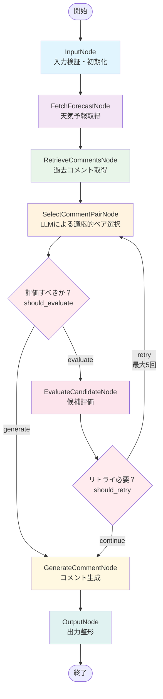

# 🏗️ アーキテクチャ

## 📁 プロジェクト構成

```
MobileCommentGenerator/
├── src/                                    # バックエンドソースコード
│   ├── workflows/                          # LangGraphワークフロー実装
│   ├── nodes/                              # 各処理ノードの実装
│   ├── llm/                                # LLMプロバイダー統合
│   ├── data/                               # データモデル・管理
│   ├── apis/                               # 外部API統合
│   └── utils/                              # ユーティリティ関数
├── frontend/                               # Nuxt.js 3 フロントエンド（Vue版）
│   ├── pages/                              # ページコンポーネント
│   ├── components/                         # UIコンポーネント
│   ├── composables/                        # Composition API
│   └── nuxt.config.ts                      # Nuxt設定
├── react-version/                          # React版フロントエンド（新規）
│   ├── src/                                # Reactソースコード
│   ├── public/                             # 静的ファイル
│   └── vite.config.ts                      # Vite設定
├── shared/                                 # 共通ロジック・型定義
│   ├── types/                              # 共通型定義
│   ├── api/                                # APIクライアント
│   ├── composables/                        # 共通ロジック
│   └── utils/                              # 共通ユーティリティ
├── tests/                                  # テストスイート
├── docs/                                   # ドキュメント
├── examples/                               # 使用例
├── config/                                 # 設定ファイル
├── app.py                                  # Streamlit UI
├── api_server.py                           # FastAPI サーバー
├── output/                                 # CSVファイル出力ディレクトリ
├── .github/                                # GitHub Actions CI/CD
│   └── workflows/                          # ワークフロー定義
├── pnpm-workspace.yaml                     # pnpmモノレポ設定
├── uv.lock                                 # uvロックファイル
├── requirements.txt                        # 従来の依存関係ファイル
├── pytest.ini                              # pytest設定
├── mypy.ini                                # mypy設定
├── Makefile                                # ビルド・実行スクリプト
├── setup.sh                                # セットアップスクリプト
└── README.md                               # このファイル
```

## 🔄 LangGraphワークフロー

以下はMobileCommentGeneratorの正確なワークフロー構造です：



### ワークフローの詳細説明

1. **InputNode**: 入力パラメータの検証と初期状態の設定
2. **FetchForecastNode**: WxTech APIから天気予報データを取得（12時間周期）
3. **RetrieveCommentsNode**: ローカルCSVファイルから過去のコメントデータを取得
4. **SelectCommentPairNode**: LLMが天気に基づいて最適なコメントペアを選択
5. **EvaluateCandidateNode**: 選択されたペアの評価（評価基準に基づく検証）
6. **GenerateCommentNode**: 最終的なコメント生成
7. **OutputNode**: 生成結果の整形と出力

### 条件分岐

- **should_evaluate**: LLMプロバイダーが設定されていない場合は評価をスキップ
- **should_retry**: 評価が失敗した場合、最大5回までリトライ

## 🌟 主要特徴

- **LangGraphワークフロー**: 状態管理とエラーハンドリングロジックを体系的に実装
- **マルチLLMプロバイダー**: OpenAI/Gemini/Anthropic対応  
- **適応性ベース選抜**: ローカルCSVから最適なペアを適応性に基づいてLLM選抜
- **表現ルール遵守**: NG表現禁止・値域制限・文字数規制の自動チェック
- **12時間周期天気予報**: デフォルトで12時間周期のデータを使用
- **デュアルUI実装**: Streamlit（開発用）+ Nuxt.js 3（Vue版） + React（新規）
- **FastAPI統合**: RESTful APIでフロントエンドとバックエンドを分離
- **天気予報キャッシュ**: 効率的な天気データ管理とキャッシュ機能
- **モノレポ構成**: pnpmワークスペースによる効率的な依存管理

## 🔧 ポート配置

- **3000番**: Nuxt.js 3フロントエンド
- **5173番**: React版フロントエンド
- **3001番**: FastAPI バックエンド
- **8501番**: Streamlit開発UI