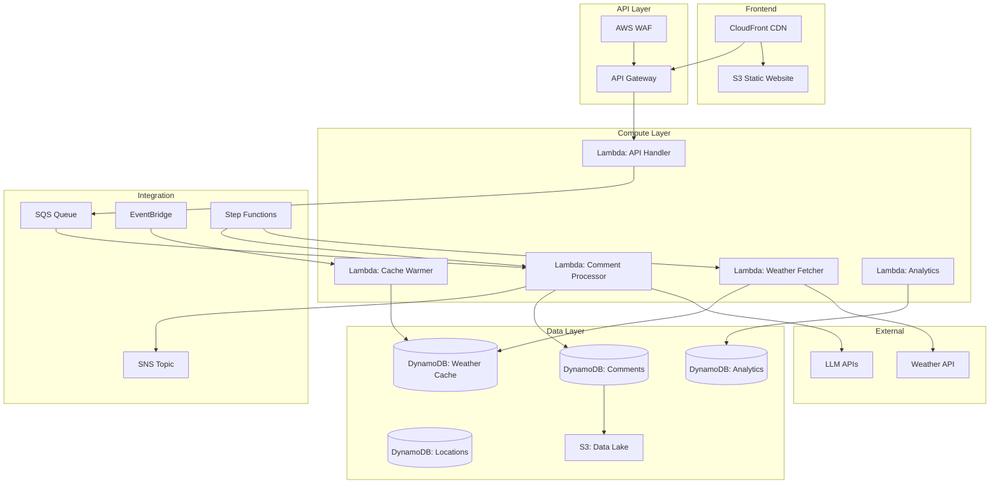

# AWS Lambda + DynamoDB デプロイメントアーキテクチャ

## 概要

本ドキュメントでは、MobileCommentGeneratorをAWS Lambda + DynamoDBで運用するためのモダンなサーバーレスアーキテクチャを定義します。

## アーキテクチャ図



## コンポーネント詳細

### 1. Lambda関数

#### 1.1 API Handler (`comment-generator-api`)
```yaml
Runtime: Python 3.11
Memory: 512 MB
Timeout: 30 seconds
Architecture: arm64
Environment:
  - DYNAMODB_TABLE_COMMENTS
  - SQS_QUEUE_URL
  - POWERTOOLS_SERVICE_NAME
```

**責務:**
- API Gatewayからのリクエスト受付
- リクエストバリデーション
- SQSへの非同期ジョブ投入
- DynamoDBからの結果取得

#### 1.2 Weather Fetcher (`weather-fetcher`)
```yaml
Runtime: Python 3.11
Memory: 256 MB
Timeout: 60 seconds
Reserved Concurrency: 10
```

**責務:**
- 天気APIからのデータ取得
- DynamoDB Weather Cacheへの保存
- 空間キャッシュの管理

#### 1.3 Comment Processor (`comment-processor`)
```yaml
Runtime: Python 3.11
Memory: 1024 MB
Timeout: 300 seconds
Reserved Concurrency: 5
```

**責務:**
- LLM APIへのリクエスト
- コメント生成ロジック実行
- 結果のDynamoDB保存
- SNS通知

#### 1.4 Cache Warmer (`cache-warmer`)
```yaml
Runtime: Python 3.11
Memory: 512 MB
Timeout: 900 seconds
Schedule: rate(1 hour)
```

**責務:**
- 人気地点の事前キャッシュ
- 期限切れデータのクリーンアップ

### 2. DynamoDBテーブル設計

#### 2.1 Comments Table
```yaml
TableName: weather-comments
PartitionKey: location_id (String)
SortKey: generated_at (String) # ISO8601 timestamp
Attributes:
  - comment_id: String (UUID)
  - location_name: String
  - weather_data: Map
  - generated_comment: String
  - advice_comment: String
  - llm_provider: String
  - generation_metadata: Map
  - ttl: Number
GlobalSecondaryIndexes:
  - GSI1:
      PartitionKey: comment_date (String) # YYYY-MM-DD
      SortKey: generated_at
  - GSI2:
      PartitionKey: llm_provider
      SortKey: generated_at
StreamSpecification:
  StreamViewType: NEW_AND_OLD_IMAGES
```

#### 2.2 Weather Cache Table
```yaml
TableName: weather-cache
PartitionKey: location_id (String)
SortKey: forecast_time (String)
Attributes:
  - cached_at: String
  - weather_data: Map
  - ttl: Number
GlobalSecondaryIndexes:
  - GSI1: # 空間インデックス
      PartitionKey: geohash (String)
      SortKey: forecast_time
```

#### 2.3 Locations Table
```yaml
TableName: location-metadata
PartitionKey: location_id (String)
Attributes:
  - location_name: String
  - coordinates: Map {lat, lon}
  - geohash: String
  - region: String
  - access_count: Number
  - last_accessed: String
  - popular_rank: Number
```

### 3. 非同期処理アーキテクチャ

#### 3.1 SQSキュー構成
```yaml
CommentGenerationQueue:
  VisibilityTimeout: 360
  MessageRetentionPeriod: 1209600 # 14 days
  ReceiveMessageWaitTimeSeconds: 20
  RedrivePolicy:
    deadLetterTargetArn: !GetAtt DLQ.Arn
    maxReceiveCount: 3
```

#### 3.2 Step Functions ワークフロー
```json
{
  "Comment": "Weather comment generation workflow",
  "StartAt": "CheckCache",
  "States": {
    "CheckCache": {
      "Type": "Task",
      "Resource": "arn:aws:lambda:CheckCacheFunction",
      "Next": "CacheDecision"
    },
    "CacheDecision": {
      "Type": "Choice",
      "Choices": [{
        "Variable": "$.cacheHit",
        "BooleanEquals": true,
        "Next": "ReturnCached"
      }],
      "Default": "FetchWeather"
    },
    "FetchWeather": {
      "Type": "Task",
      "Resource": "arn:aws:lambda:WeatherFetcher",
      "Retry": [{
        "ErrorEquals": ["States.TaskFailed"],
        "IntervalSeconds": 2,
        "MaxAttempts": 3,
        "BackoffRate": 2
      }],
      "Next": "GenerateComment"
    },
    "GenerateComment": {
      "Type": "Task",
      "Resource": "arn:aws:lambda:CommentProcessor",
      "Next": "SaveResult"
    },
    "SaveResult": {
      "Type": "Task",
      "Resource": "arn:aws:lambda:SaveToDynamoDB",
      "End": true
    },
    "ReturnCached": {
      "Type": "Pass",
      "End": true
    }
  }
}
```

### 4. セキュリティ設計

#### 4.1 IAMロール
```yaml
LambdaExecutionRole:
  Policies:
    - DynamoDBAccess:
        - dynamodb:GetItem
        - dynamodb:PutItem
        - dynamodb:Query
        - dynamodb:UpdateItem
    - SecretsManagerAccess:
        - secretsmanager:GetSecretValue
    - CloudWatchLogs:
        - logs:CreateLogGroup
        - logs:CreateLogStream
        - logs:PutLogEvents
```

#### 4.2 Secrets Manager
```yaml
Secrets:
  - weather-api-keys:
      WXTECH_API_KEY: "encrypted"
  - llm-api-keys:
      OPENAI_API_KEY: "encrypted"
      GEMINI_API_KEY: "encrypted"
      ANTHROPIC_API_KEY: "encrypted"
```

### 5. 監視とロギング

#### 5.1 CloudWatch Metrics
```yaml
CustomMetrics:
  - CommentGenerationLatency
  - CacheHitRate
  - LLMAPILatency
  - WeatherAPILatency
  - DynamoDBThrottles
```

#### 5.2 X-Ray Tracing
```python
from aws_xray_sdk.core import xray_recorder
from aws_xray_sdk.ext.flask.middleware import XRayMiddleware

@xray_recorder.capture('generate_comment')
def generate_comment(location, weather_data):
    # トレーシング付きの処理
    pass
```

### 6. パフォーマンス最適化

#### 6.1 Lambda Layers
```yaml
Layers:
  - PythonDependencies:
      - boto3
      - pydantic
      - httpx
  - SharedCode:
      - /opt/python/shared/
```

#### 6.2 Lambda SnapStart代替
```python
# グローバルスコープで初期化
dynamodb = boto3.resource('dynamodb')
table = dynamodb.Table(os.environ['COMMENTS_TABLE'])

def handler(event, context):
    # ウォームスタート時に高速化
    pass
```

#### 6.3 DynamoDB最適化
- On-Demandモードで自動スケーリング
- Partition Key設計で均等分散
- GSIで効率的なクエリ

### 7. コスト最適化

#### 7.1 料金見積もり
```yaml
月間想定:
  - API呼び出し: 100万回
  - Lambda実行時間: 50,000 GB-秒
  - DynamoDB:
    - 読み取り: 200万RCU
    - 書き込み: 50万WCU
  - 推定月額: $50-100
```

#### 7.2 コスト削減策
- Lambda Graviton2 (arm64)使用
- DynamoDB TTLで古いデータ自動削除
- S3 Intelligent-Tieringで長期保存
- CloudFront キャッシング

### 8. デプロイメント

#### 8.1 SAMテンプレート
```yaml
AWSTemplateFormatVersion: '2010-09-09'
Transform: AWS::Serverless-2016-10-31

Globals:
  Function:
    Runtime: python3.11
    Architectures:
      - arm64
    Tracing: Active
    Environment:
      Variables:
        POWERTOOLS_SERVICE_NAME: weather-comment-generator

Resources:
  CommentGeneratorAPI:
    Type: AWS::Serverless::Function
    Properties:
      CodeUri: functions/api_handler/
      Handler: app.lambda_handler
      Events:
        ApiEvent:
          Type: Api
          Properties:
            Path: /generate
            Method: POST
```

#### 8.2 GitHub Actions CI/CD
```yaml
name: Deploy to AWS Lambda
on:
  push:
    branches: [main]

jobs:
  deploy:
    runs-on: ubuntu-latest
    steps:
      - uses: actions/checkout@v3
      - uses: aws-actions/setup-sam@v2
      - run: sam build
      - run: sam deploy --no-confirm-changeset
```

## まとめ

このアーキテクチャにより：
- **高可用性**: サーバーレスで自動スケーリング
- **低レイテンシ**: キャッシュとCDNで高速化
- **コスト効率**: 使用分のみの課金
- **保守性**: マイクロサービスで疎結合
- **拡張性**: イベント駆動で新機能追加が容易